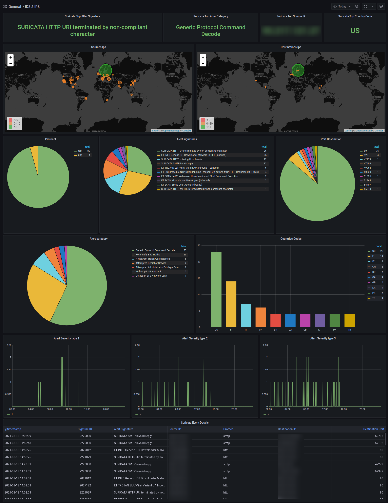

# IDS / IPS Dashboard
this is a dashboard that visualizes suricata entries

## Require
suricata  
elasticsearch <7.xx  
filebeat <7.xx  
grafana 7.xx/8.xx  

## Configure

filebeat:
```
# ---------------------------- Elasticsearch Output ----------------------------
output.elasticsearch:
  # Array of hosts to connect to.
  hosts: ["yourhostip:port"]
  # index: "filebeat-suricata"
  # Protocol - either `http` (default) or `https`.
  #protocol: "https"

  # Authentication credentials - either API key or username/password.
  #api_key: "id:api_key"
  username: "elasticuser"
  password: "setsecrethere"
```
we use the suricata module from filebeat:

```
cd /etc/filebeat/modules.d
mv suricata.yml.disabled suricata.yml
```

## screenshot

